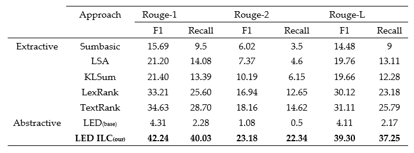

This is supplementary webpage for paper  [ILC: Indian Legal Corpus](https://github.com/d0r1h/ILC/edit/gh-pages/index.md).


### DataSet

You can use HuggingFace 🤗 dataset loader

```markdown
!pip install datasets

from datasets import load_dataset

dataset = load_dataset("d0r1h/ILC")

train_set = pd.DataFrame(dataset['train'])
test_set = pd.DataFrame(dataset['test'])
```


### Models

[led-base-ilc](https://huggingface.co/d0r1h/led-base-ilc) is fine-tuned version of [led-base-16384](https://huggingface.co/allenai/led-base-16384) on the [ILC](https://huggingface.co/datasets/d0r1h/ILC) dataset. 

### Results 


